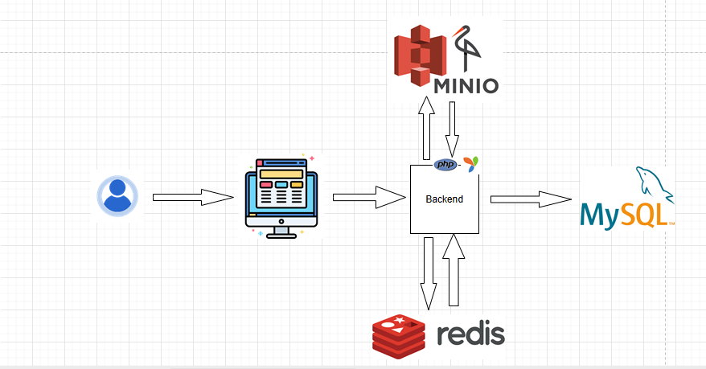

# Quiz-School (Student Panel)

Part of the **Quiz-School.uz** platform, this module is designed for school students to take electronic tests and view results instantly. It aims to digitize and simplify the traditional paper-based assessment process in schools.

---

## 🧩 Problem It Solves

In many schools, midterm tests are still paper-based — requiring teachers to print individual test sheets, manually distribute them, and later collect and evaluate handwritten answers. This process consumes excessive **time, paper, effort, and cost**.

---

## ✅ Our Solution

Quiz-School replaces the entire paper process with a two-module digital platform:

### 🧑‍🎓 Student Panel (this module)
- Students register and log in to the platform.
- They are shown the tests specifically assigned to their class.
- After completing a test, results are automatically evaluated within seconds.
- Students receive detailed feedback showing which questions were incorrect, which options they selected, and which were correct.
- Every test attempt is saved with date and timestamp in "My Results" for future reference.

### 👨‍🏫 Teacher Panel (Separate Module)
- Teachers register and upload test files in Excel format.
- The system parses the Excel and converts it into a usable quiz format.
- Teachers can track which students completed the test.
- Results are displayed in tables and can be inspected in detail per student.

🔗 [Teacher Panel GitHub Repository](https://github.com/Azizbekutkirovich/Quiz-school-teacher)

---

## ⚙️ Tech Stack

- HTML
- CSS (Bootstrap 5)
- Javascript
- PHP 8.2
- Yii2-basic 2.0.51
- MySQL
- Redis
- MinIO
- Docker


---

---

## 🖼️ Architecture Diagram (Screenshot)

The following diagram illustrates the overall architecture of the project:



---

---

---

### 🔧 Technical Details

- **Redis** is used as a cache layer to improve performance and prevent repeated Excel file parsing.
  - Configured in [`config/web.php`](https://github.com/Azizbekutkirovich/Quiz-school/blob/main/config/web.php) using Yii2's built-in `cache` component.
  - No custom component is used; Yii2’s default `yii\caching\RedisCache` handles all caching logic.
  - Commonly used in the test import module to cache parsed test data temporarily.

- **MinIO** is used as an S3-compatible object storage to handle uploaded Excel files.
  - Integrated as a custom Yii2 component.
  - The component implementation can be found in [`components/MinioComponent.php`](https://github.com/Azizbekutkirovich/Quiz-school/blob/main/components/MinioComponent.php).
  - Uploaded Excel files are directly stored in MinIO instead of the local file system to optimize storage space and support scalability.

---

---

## 🚀 How to Run Locally

```bash
git clone https://github.com/Azizbekutkirovich/Quiz-school.git
cd quiz-school
composer install
# Configure database in config/db.php
php yii migrate
php yii serve

```

## 📁 Related Projects

- [Quiz-School Teacher Panel](https://github.com/Azizbekutkirovich/Quiz-school-teacher) – For teachers to upload and track tests.

---

## 👤 Author

Created by [Azizbek Utkirovich](https://github.com/Azizbekutkirovich)

📧 Email: azizbek250607@gmail.com
